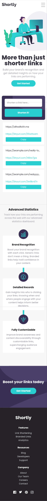
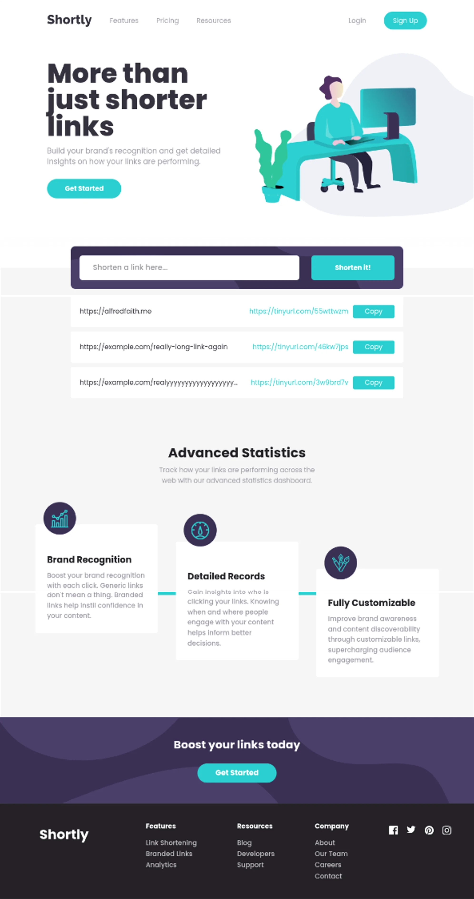

# Frontend Mentor - Shortly URL shortening API Challenge solution

This is a solution to the
[Shortly URL shortening API Challenge challenge on Frontend Mentor](https://www.frontendmentor.io/challenges/url-shortening-api-landing-page-2ce3ob-G).
Frontend Mentor challenges help you improve your coding skills by
building realistic projects.

## Table of contents

- [Overview](#overview)
  - [The challenge](#the-challenge)
  - [Screenshot](#screenshot)
  - [Links](#links)
- [My process](#my-process)
  - [Built with](#built-with)
  - [What I learned](#what-i-learned)
  - [AI Collaboration](#ai-collaboration)
- [Author](#author)

## Overview

### The challenge

Users should be able to:

- View the optimal layout for the site depending on their device's screen size
- Shorten any valid URL
- See a list of their shortened links, even after refreshing the browser
- Copy the shortened link to their clipboard in a single click
- Receive an error message when the `form` is submitted if:
  - The `input` field is empty

### Screenshot

Target Build:

- General Overview
  

Solution Built:

- Mobile View:
  

- Desktop View:
  

### Links

- Solution URL: [GitHub Source Code](https://github.com/TonyFred-code/url-shortener/)
- Live Site URL: [Vercel Deployed Demo](https://url-shortener-drab-nu.vercel.app/)

## My process

### Built with

- Semantic HTML5 markup
- Mobile-first workflow
- [React](https://reactjs.org/) - JS library
- [TailwindCSS](https://tailwindcss.com/) - CSS framework
- [Vite](https://vite.dev/) - Build Tool
- [Lucide Icons](https://lucide.dev/icons/) - React Icons Package
- [TinyURL](https://tinyurl.com/) - URL shortener API

### What I learned

- I learnt about the distinction between the visual presentation
  and structural presentation

### AI Collaboration

Work with `Claude` as described in
[AGENTS Collaboration Specification](./AGENTS.md) file

## Getting Started

### Prerequisites

Node.js (v20+ recommended)
Git

### Development Build

To run this project locally, follow these steps:

- Clone your fork of the repository:

```bash
git clone https://github.com/yourusername/url-shortener.git
```

- Navigate to the project directory

```bash
cd url-shortener
```

- Install dependencies

```bash
npm install
```

- Set up environment variables

Copy the example env file and fill in your TinyURL API token:

​`bash
cp .env.example .env.development
​`

Then open `.env.development` and set:

​`
VITE_URL_AUTH_TOKEN=your_tinyurl_api_token_here
​`

You can get a free API token from [TinyURL](https://tinyurl.com/app/dev).

- Start the development server

```bash
npm run dev
```

The app will be available at: `http://localhost:5173`

### Production Build

```bash
npm run build
npm run preview
```

## Author

- Personal Website - [alfred.code](https://alfredfaith.me)
- Frontend Mentor - [@TonyFred-code](https://www.frontendmentor.io/profile/TonyFred-code)
- X (previously Twitter) - [@alfredfaith35](https://www.x.com/alfredfaith35)
